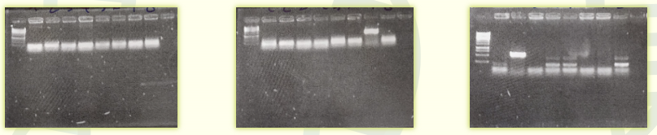
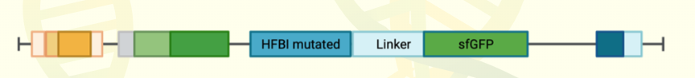
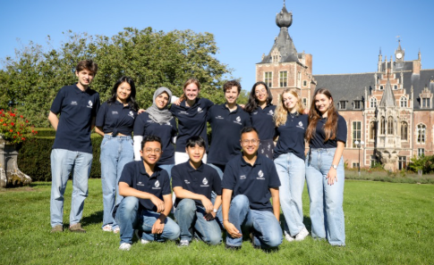

# 🧬 iGEM KU Leuven 2023 — YarroWCO

> **A synthetic biology project engineering *Yarrowia lipolytica* to produce campesterol — a key steroid drug precursor — using Waste Cooking Oil (WCO) as a carbon source.**

---

## 📋 Table of Contents

1. [Project Introduction](#1-project-introduction)
2. [Overview & Key Models](#2-overview--key-models)
3. [Experimental Design](#3-experimental-design)
4. [Lab Notebooks & Protocols](#4-lab-notebooks--protocols)
5. [Results](#5-results)
6. [BioBrick Parts Contribution](#6-biobrick-parts-contribution)
7. [Conclusions & Future Directions](#7-conclusions--future-directions)
8. [References](#8-references)
9. [👥 Team & Author](#9-team--author)

---

## 1. Project Introduction

### Background: Why This Project?

Over **two billion tons of waste cooking oil (WCO)** were produced globally in 2016 alone. Belgium is renowned for its fried food culture; in 2021, approximately 88,000 metric tons of WCO were generated in the country. Just one liter of WCO can contaminate over one million liters of water.

The EU currently converts WCO into biodiesel (UCOME), but combustion still releases CO₂. This project explores a higher-value alternative.

  
   
  <em><b>Figure 2.</b> Current synthesis methods vs. our proposed biosynthetic approach using WCO.</em>

### Core Concept

We aim to replace traditional plant/animal extraction with WCO-based biosynthesis via *Y. lipolytica*. The target product is **Campesterol**, a critical precursor for corticosteroids and sex hormones (~$10 billion market).

  
   
  <em><b>Figure 4.</b> Different types of surfactants. Left: Tween 80 (synthetic). Right: HFBI, a hydrophobin expressed by our team to aid WCO uptake.</em>

  
   
  <em><b>Figure 3.</b> Metabolic pathways in Yarrowia lipolytica, focusing on the Mevalonate pathway.</em>

---

## 2. Overview & Key Models

> 📌 **iGEM 2023 Best Model Nominee**
> Official model page: [https://2023.igem.wiki/kuleuven/model](https://2023.igem.wiki/kuleuven/model)

Our computational work integrated structural biology and growth kinetics into four main pillars.

  
   
  <em><b>Dry Lab Summary:</b> Enzyme screening, Growth model, Hydrophobin design, and Genetic switch.</em>

### 2.1 Core Dry Lab Objectives

* **DHCR7 Enzyme Screening:** *In silico* screening of 10 DHCR7 candidate enzymes via molecular docking and MD simulations. (Note: DHCR7 structures are AlphaFold3/CSM predictions).
* **Yarrowia lipolytica Growth Model:** Modelled using R packages (`biogrowth`, `growthrates`) comparing glucose vs. oil-based media.
* **Hydrophobin Design (pI Optimisation):** Substituted Lys/Arg with Glu/Asp in HFBI to lower the isoelectric point, improving emulsification at the acidic pH preferred by *Y. lipolytica*.

---

## 3. Experimental Design

### 3a. Engineering Cycle (DBTL)

Three complete DBTL iterations were performed in *E. coli* to optimize expression vector construction.

  
   
  <em><b>Figure 5.</b> Summary of wet lab activities performed in E. coli.</em>

#### Iteration 1: First Cloning Attempt in pET28

We initially designed AcGFP-linker-hydrophobin fusion constructs using a Golden Gate cloning strategy.

  
   
  <em><b>Table 1.</b> Hydrophobin candidates screened for expression.</em>

  
  
   
  <em><b>Left: Figure 3.</b> Vector map of the pET28_AcGFP_MBSP1. <b>Right: Figure 4.</b> First iteration agarose gel showing successful insert PCR but failed backbone amplification.</em>

#### Iterations 2 & 3: Transition to pET29-linker-sfGFP System

To overcome backbone issues, we switched to Gibson Assembly and a pET29-sfGFP backbone with a 21 bp linker (SGGSGGS).

  
   
  <em><b>Figure 7.</b> Flowchart for intermediate plasmid assembly.</em>

  
  
   
  <em><b>Figures 5 & 6.</b> Optimized vector maps for biosurfactant-sfGFP fusions.</em>

---

## 4. Lab Notebooks & Protocols

Detailed documentation of our daily work and computational protocols. Click the links below to view the PDF files.

* **Experimental Design & Protocols:**
  * [Experimental Design Document](Figures/experimental-design-2.pdf)
  * [MD Protocol](Figures/md-protocol.pdf)
* **Dry Lab Notebooks:**
  * [DHCR7 Enzyme Screening Notebook](Figures/dry-lab-notebook-enzyme-screening.pdf)
  * [Hydrophobin Design Notebook](Figures/dry-lab-notebook-hydrophobin-design.pdf)
  * [Genetic Switch Notebook](Figures/dry-lab-notebook-genetic-switch.pdf)
* **Wet Lab Notebooks:**
  * [Pinheiro Lab Notebook](Figures/notebook-pinheiro-lab.pdf)
  * [Van Dijck Lab Notebook](Figures/notebook-van-dijck-lab.pdf)

---

## 5. Results

### 5.1 Wet Lab Results

#### PCR & Colony Confirmation
We systematically validated gene fragments and transformants for MBSP1, HFBI, and HFBII.

  
  
  
   
  <em><b>PCR Results (Figures 1, 14, 15):</b> High-fidelity amplification of inserts and backbone.</em>

  
  
  
  
   
  <em><b>Colony PCR (Figures 2-5):</b> Verification of Gibson assemblies.</em>

  
   
  <em><b>Figures 16-18.</b> Representative colony PCR summary verifying integration.</em>

#### Sequencing & Protein Expression
Macrogen Sanger sequencing confirmed correct reading frames. SDS-PAGE revealed that Cys→Ser substitutions improved HFBI expression.

  
  
   
  <em><b>Figures 6 & 8.</b> High-quality chromatograms confirming sfGFP-linker-target reading frames.</em>

  
  
   
  <em><b>Protein Analysis (Figures 7 & 9):</b> SDS-PAGE showing higher yield for mutant HFBI and visible GFP fluorescence in pellet.</em>

### 5.2 Dry Lab Results

* **DHCR7 Enzyme Screening:** Docking completed for 10 DHCR7 variants; best complexes ran through 20 ns MD simulations.
* **Hydrophobin pI Analysis:** 26 variants generated. PredictSNP confirmed Lys/Arg substitutions remained structurally neutral while effectively lowering pI to ~4.05.

---

## 6. BioBrick Parts Contribution

We submitted standardized parts to the iGEM Registry to facilitate future surfactant research.

  
   
  <em><b>Part BBa_K4661015:</b> HFBI (mutant)-Linker-sfGFP cassette.</em>

  
   
  <em>Validation primer sequences for Registry submission.</em>

---

## 7. Conclusions & Future Directions

### Achievements
* **Wet Lab:** Expressed MBSP1 and HFBI in *E. coli*; verified that Cys→Ser mutations enhance yield.
* **Dry Lab:** Completed DHCR7 screening, quantitatively characterised AlphaFold limitations, and designed pI-reduced hydrophobins.

### Future Strategy: Promoter & Strain Engineering
We proposed a transition to a "Marionette" promoter system for tighter regulation and designed expression vectors for yeast.

  
   
  <em><b>Figure 10.</b> Proposed optimization of leaky vs. tight inducible promoters.</em>

  
  
   
  <em><b>Figures 10 & 11 (Plasmids).</b> Designed vectors for future testing in S. cerevisiae (pBEVY) and Y. lipolytica (NDV).</em>

---

## 8. References

1. Du, H.X. et al. Engineering *Yarrowia lipolytica* for campesterol overproduction. *PLoS ONE* **11** (2016)

2. Zhang, Y. et al. Improved campesterol production in engineered *Yarrowia lipolytica* strains. *Biotechnol. Lett.* **39** (2017)

3. Jumper, J. et al. Highly accurate protein structure prediction with AlphaFold. *Nature* **596** (2021)

4. Mirdita, M. et al. ColabFold: making protein folding accessible to all. *Nat. Methods* **19** (2022)

5. Trott, O. & Olson, A.J. AutoDock Vina: Improving the speed and accuracy of docking with a new scoring function, efficient optimization, and multithreading. *J. Comput. Chem.* (2009)

6. Pettersen, E.F. et al. UCSF Chimera — A visualization system for exploratory research and analysis. *J. Comput. Chem.* **25** (2004)

7. Laskowski, R.A. & Swindells, M.B. LigPlot+: Multiple ligand-protein interaction diagrams for drug discovery. *J. Chem. Inf. Model.* **51** (2011)

8. Stierand, K., Maaß, P.C. & Rarey, M. Molecular complexes at a glance: Automated generation of two-dimensional complex diagrams. *Bioinformatics* **22** (2006)

9. Cock, P.J.A. et al. Biopython: Freely available Python tools for computational molecular biology and bioinformatics. *Bioinformatics* **25** (2009)

10. Bendl, J. et al. PredictSNP: Robust and Accurate Consensus Classifier for Prediction of Disease-Related Mutations. *PLoS Comput. Biol.* **10** (2014)

11. Schymkowitz, J. et al. The FoldX web server: An online force field. *Nucleic Acids Res.* **33** (2005)

12. Radusky, L.G. & Serrano, L. PyFoldX: enabling biomolecular analysis and engineering along structural ensembles. *Bioinformatics* **38** (2022)

13. Jun Cheng et al. Accurate proteome-wide missense variant effect prediction with AlphaMissense. *Science* **381**, eadg7492 (2023)

14. Leon, M. et al. A computational method for the investigation of multistable systems and its application to genetic switches. *BMC Syst. Biol.* **10** (2016)

15. Gardner, T.S., Cantor, C.R. & Collins, J.J. Construction of a genetic toggle switch in *Escherichia coli*. *Nature* **403** (2000)

16. Bonnet, J., Subsoontorn, P. & Endy, D. Rewritable digital data storage in live cells via engineered control of recombination directionality. *Proc. Natl Acad. Sci. USA* **109** (2012)

---

## 9. 👥 Team & Author

  
   
  <em><b>iGEM KU Leuven 2023 Team 'YarroWCO' at Arenberg Castle.</b></em>

 

  [🌐 Official Wiki](https://2023.igem.wiki/kuleuven/) | [🔬 Project Description](https://2023.igem.wiki/kuleuven/description) | [📊 Model](https://2023.igem.wiki/kuleuven/model)

